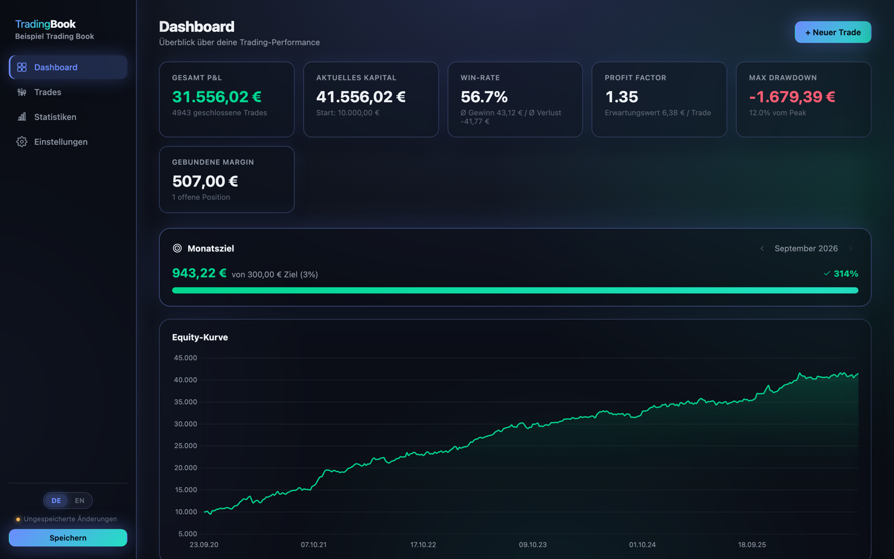
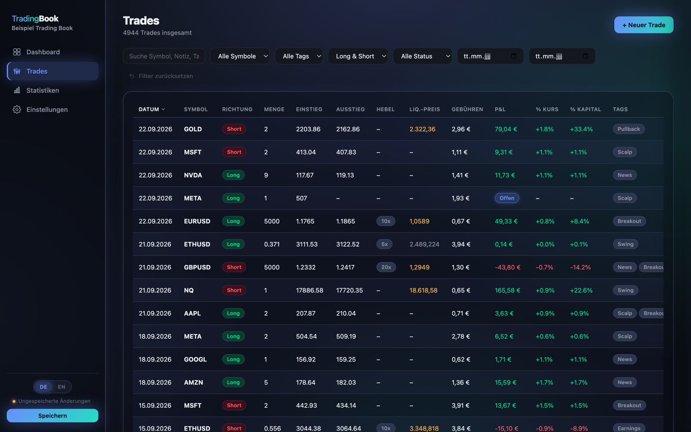
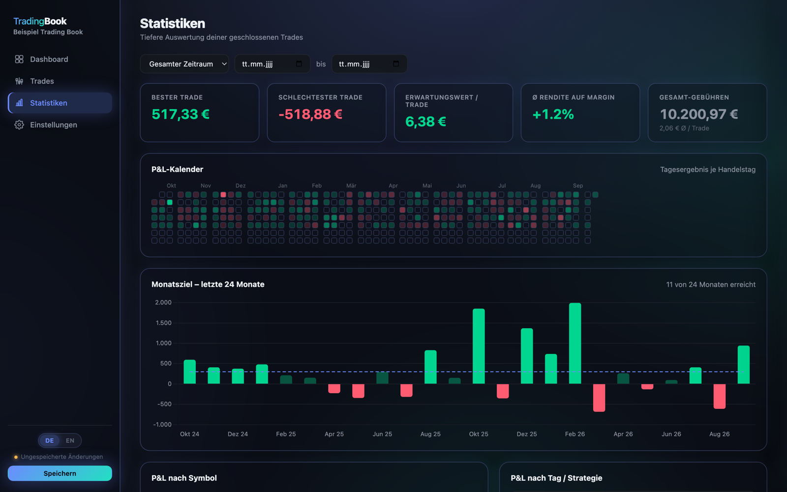

<div align="center">



# TradingBook

**Ein lokales Trading-Journal, das dein Gerät nie verlässt.**

Kein Account. Keine Cloud. Keine Installation. Deine Trade-Historie liegt in einer einzigen JSON-Datei, die du selbst kontrollierst.

[](https://trading-book.de)
[](LICENSE)
[](#technik)

[**🚀 Jetzt ausprobieren**](https://trading-book.de) · [English version](README.md) · [Funktionen](#funktionen) · [Schnellstart](#schnellstart)

</div>

---

## Warum TradingBook

Die meisten Trading-Journale sind SaaS-Produkte: Man legt einen Account an, ein fremder Server verwaltet die eigene Trade-Historie, und man hofft, dass der Anbieter langfristig bestehen bleibt. TradingBook geht den umgekehrten Weg — es ist eine einzelne statische Webseite. Im Browser öffnen, eine JSON-Datei auf der eigenen Festplatte auswählen (oder neu anlegen) — diese Datei *ist* die Datenbank. Es wird nichts irgendwohin hochgeladen. Tab schließen, und die Daten liegen exakt dort, wo man sie zurückgelassen hat: auf der eigenen Festplatte.

- **Privat by Design** — es gibt keinen Server, an den die Daten überhaupt gehen könnten. Alles läuft clientseitig im Browser.
- **Keine Installation, kein Build-Schritt** — reines HTML/CSS/JavaScript. `index.html` öffnen, oder direkt die [gehostete Version](https://trading-book.de) nutzen.
- **Deine Datei, deine Regeln** — eine portable `.json`, die du selbst sichern, versionieren, synchronisieren oder einsehen kannst.
- **Zweisprachig** — vollständige deutsche/englische Oberfläche, sofort umschaltbar, ohne Neuladen.

## Funktionen

- **Dashboard** — Gesamt-P&L, Win-Rate, Profit Factor, Erwartungswert, Max Drawdown, gebundene Margin, eine Equity-Kurve sowie die letzten Trades auf einen Blick.
- **Trades-Tabelle** — sortierbar, filterbar (Symbol, Tag, Richtung, Status, Zeitraum), paginiert — bleibt auch bei mehreren Zehntausend Trades performant.
- **Statistiken** — Zeitraum-Filter, ein P&L-Kalender im GitHub-Contribution-Stil, Auswertungen nach Symbol/Tag/Wochentag, eine P&L-Verteilung sowie R-Multiples je Trade (sofern ein Stop-Loss hinterlegt ist).
- **Monatsziel-Tracking** — Zielrendite in % festlegen, Fortschritt inkl. Verlauf der letzten 24 Monate verfolgen.
- **Hebel & Risiko-Tools** — Hebel oder manuelle Margin pro Trade (passt für CFD/Forex/Krypto-Margin *und* Futures/Optionen), inkl. näherungsweisem Liquidationspreis und automatischen Warnungen bei zu hohem Hebel oder einem Stop-Loss hinter dem Liquidationspreis.
- **Gebühren, überall berücksichtigt** — jede P&L-Kennzahl (Dashboard, Equity-Kurve, Drawdown, Kalender, Monatsziel, R-Multiples) rechnet Gebühren mit ein, nicht nur die reine Kursbewegung.
- **Mobil nutzbar** — auf dem Smartphone wechselt die Oberfläche zu Tab-Leiste unten, Trade-Karten statt breiter Tabelle, Filter-Sheet und Vollbild-Formular; Speichern läuft über das Teilen-Menü („In Dateien sichern“).
- **Rückgängig statt Rückfrage** — Löschen eines Trades zeigt einen Toast mit Rückgängig-Option statt eines Bestätigungsdialogs.

## Screenshots

<table>
<tr>
<td></td>
<td></td>
</tr>
<tr>
<td></td>
<td></td>
</tr>
</table>

## Schnellstart

**Direkt nutzen, kein Download nötig:** [**trading-book.de**](https://trading-book.de) — die Daten verlassen trotzdem nie deinen Browser, die Seite liefert nur die statischen Dateien aus.

**Oder selbst hosten:**

```bash
git clone https://github.com/TeeRiese/tradingbook.git
cd tradingbook/app
python3 -m http.server 8080   # jeder statische Webserver funktioniert
```

Dann `http://localhost:8080` in Chrome oder Edge öffnen. (`app/index.html` direkt per `file://` öffnen funktioniert auch, aber ein paar Browser-Funktionen — z.B. das automatische Wiederverbinden mit einer Datei nach einem Neuladen — brauchen einen echten HTTP-Origin.)

Ein Beispiel-Datensatz (`app/data/beispiel.json`, ca. 5.000 Trades) liegt bei — über "Vorhandene Datei öffnen" auswählbar, um die App mit realistischen Daten auszuprobieren, bevor eigene Trades eingetragen werden.

## Browser-Unterstützung

Der volle Funktionsumfang (direktes Lesen/Schreiben der Datei, ohne Download-Dialog) braucht die **File System Access API** — aktuell **Chrome oder Edge**. Safari und Firefox funktionieren ebenfalls, Speichern fällt dort auf einen regulären Datei-Download zurück statt direkt zu überschreiben. Auf dem Smartphone öffnet Speichern – sofern unterstützt – das System-Teilen-Menü; zusätzlich wird deine Sitzung im Browser zwischengespeichert — exportiere die Datei trotzdem regelmäßig.

## Technik

Reines HTML/CSS/JavaScript, kein Framework, kein Build-Schritt, eine mitgelieferte Abhängigkeit ([Chart.js](https://www.chartjs.org/)).

## Lizenz

[MIT](LICENSE) — frei nutzbar.
